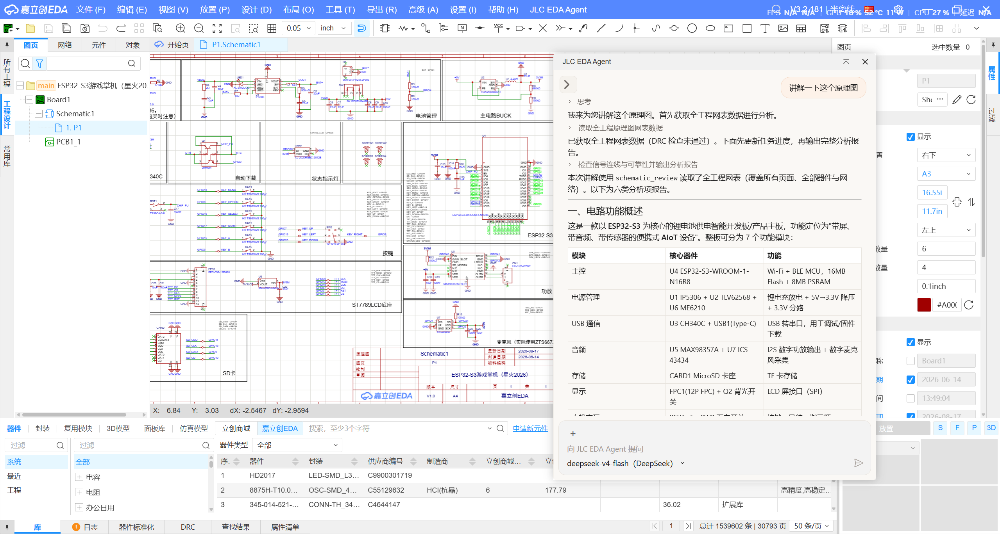
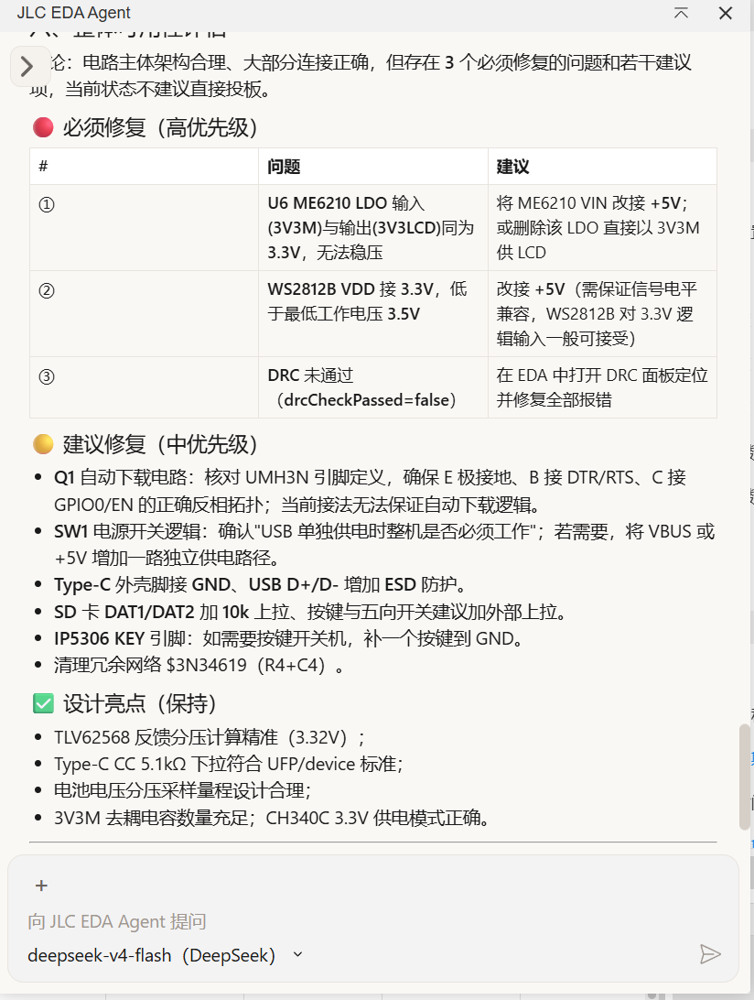
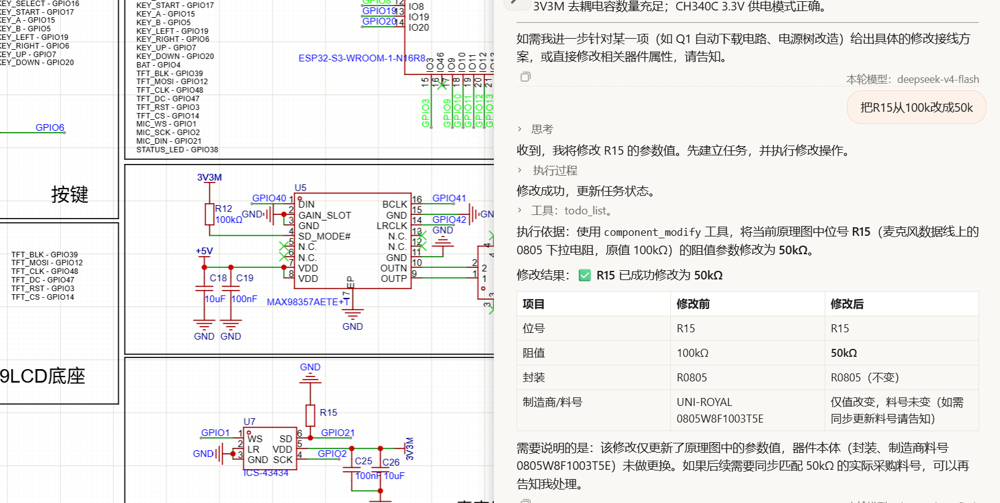
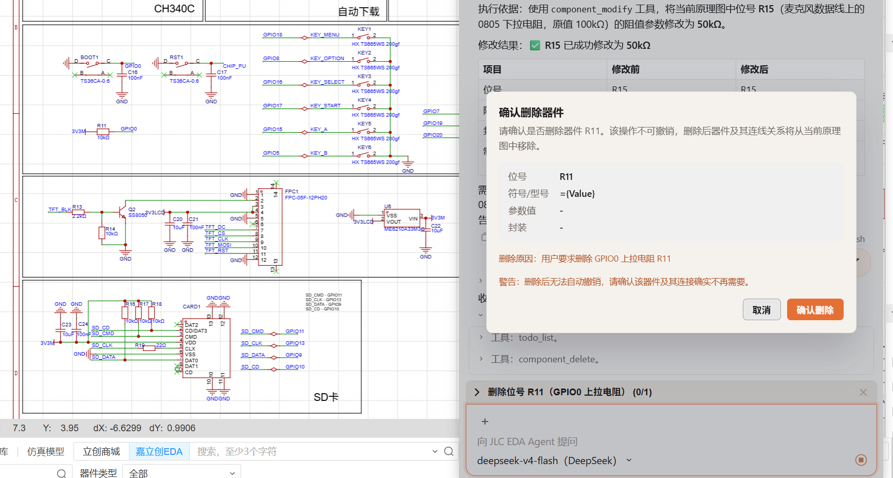
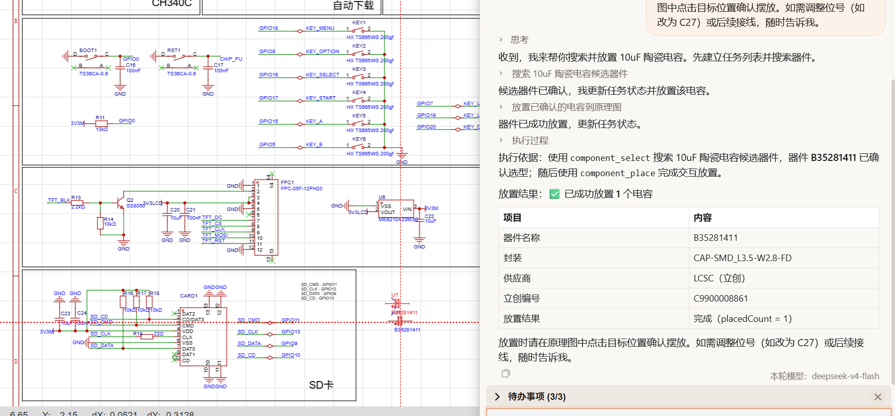

# JLC EDA Agent 作品说明


> 基于嘉立创 EDA 专业版扩展 API 的 AI 辅助设计插件，通过自然语言对话完成原理图读取、设计审查、器件修改与删除。

---

## 1. 项目概述

在硬件设计中，原理图审查往往依赖工程师个人经验，跨页信号追踪、冗余器件识别、参数合理性检查耗时且容易遗漏。JLC EDA Agent 将大语言模型与嘉立创 EDA Pro 的扩展 API 结合，让工程师可以用自然语言快速：

- **读懂原理图**：自动输出电路功能、器件清单、网络连接关系。
- **审查设计**：基于全工程网表与 DRC 结果，发现连接错误、参数异常与潜在风险。
- **安全修改**：修改器件参数、删除冗余器件，所有写入操作均经用户确认。

## 2. 技术架构

| 层级 | 说明 |
| --- | --- |
| **UI 层** | iframe 插件页面，聊天式交互，Anthropic 风格配色 |
| **Agent 层** | Tool-Use Loop，LLM 每次只能从白名单中选择工具调用 |
| **工具层** | `schematic_read`、`schematic_review`、`component_select`、`component_place`、`component_modify`、`component_delete`、`todo_list` |
| **API 层** | 嘉立创 EDA Pro 扩展 API：`sch_PrimitiveComponent`、`sch_PrimitiveWire`、`sch_Drc`、`sch_ManufactureData`、`lib_Device` 等 |
| **模型层** | 通过 OpenAI / DeepSeek / Anthropic API 调用大模型 |

## 3. 核心功能演示

### 3.1 全工程设计审查

**输入：**

```text
讲解一下这个原理图
```

插件读取全工程网表，输出电路功能概述、模块划分、器件清单与连接关系，适用于快速理解多页原理图。



### 3.2 设计问题审查报告

**输入：**

```text
审查一下这个设计有没有问题
```

插件结合 DRC 与网表，输出“必须修复”“建议修复”“设计亮点”三类结论，并给出具体位号与修改建议。



### 3.3 器件参数修改

**输入：**

```text
把 R15 从 100k 改成 50k
```

插件调用 `component_modify` 直接修改目标器件属性，并反馈修改前后的对比表格。



### 3.4 冗余器件删除

**输入：**

```text
删除 R11
```

插件调用 `component_delete` 定位器件后，先弹出确认面板展示位号、型号、参数与删除原因，用户点击“确认删除”后才执行。



### 3.5 器件搜索与交互放置

**输入：**

```text
帮我放一个 10uF 的陶瓷电容
```

插件先调用 `component_select` 搜索立创商城库并展示候选器件，用户确认后调用 `component_place` 引导在原理图中点击放置。



## 4. 安装与使用

1. 在 JLCEDA Pro 中打开 **设置 → 插件管理 → 本地导入**。
2. 选择 `build/dist/jlc-eda-agent_v0.1.0.eext` 安装。
3. 打开插件设置页，填写 API Key 并选择模型。
4. 在聊天框输入自然语言指令即可使用。

**推荐试用提示词：**

- `帮我看看当前页的原理图`
- `审查一下这个设计有没有问题`
- `把 R1 从 10k 改成 4.7k`
- `帮我放一个 10uF/0603 的陶瓷电容`

## 5. 仓库与产物

- **GitHub：** <https://github.com/metrogg/jlc-eda-agent>
- **安装包：** `build/dist/jlc-eda-agent_v0.1.0.eext`

## 6. 说明

本插件为辅助设计工具，所有审查结论与修改建议均来自大语言模型对 EDA 数据的理解，关键设计决策仍需结合 datasheets 与工程经验复核。
